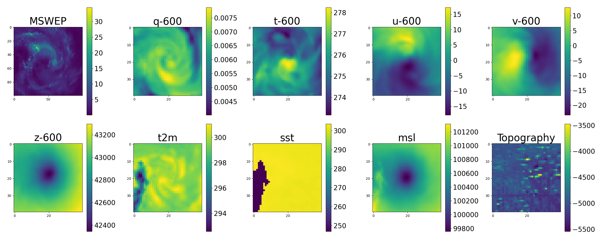

# TCPNet-Dataset

---

**TCPNet-Dataset** is a tropical cyclone (TC) dataset designed for **deep learning–based TC rainfall and track-related prediction tasks**.
It integrates historical observations, environmental reanalysis data, and future numerical weather prediction (NWP) information.

The dataset is constructed following the settings described in our paper and is used by the **TCPNet framework**.

---

## Overview

* **Time span**: 1980 – 2020
* **Total TCs**: 1877
* **Data source for tracks**: IBTrACS
* **Reanalysis / NWP data**: ERA5, ERA5-IFS
* **Rainfall product**: MSWEP
* **Coverage**: Six major ocean basins

The dataset is divided into:

* **Historical input data** 
* **Future prediction data** 

---

## 📦 Download Dataset Subset

Download the 2020 subset of the dataset via the following **link**:

**[Dataset](https://drive.google.com/file/d/1C-qlBwNENmMvojrfaZWjyfGz6L8LVwWZ/view?usp=drive_link)**

---

## Dataset Split

| Split      | Years     | Number of TCs |
| ---------- | --------- | ------------- |
| Training   | 1980–2018 | 1751          |
| Validation | 1980–2018 | 87            |
| Test       | 2018–2020 | 126           |

* Training/validation split is **random (95% / 5%)**
* Validation set is kept small due to the high computational cost of diffusion model inference

---

## Data Structure

The dataset is organized around **TC-centered patches**, aligned to the TC center at each timestamp.

All gridded data are cropped around the TC center.

---

## 1. Historical Data 

Historical data describe the **current and past environmental conditions** around a TC.

### 1.1 Rainfall Data (X_r)

* **Source**: MSWEP (Multi-Source Weighted-Ensemble Precipitation)
* **Temporal resolution**: 3-hourly
* **Spatial resolution**: 0.1°
* **Time coverage**: 1979 – near real-time
* **Spatial coverage**:

  * Cropped to **10° × 10°** around the TC center
  * Grid size: **100 × 100**

---

### 1.2 Environmental Data

Environmental variables are collected from **ERA5** and include both surface and pressure-level data.

#### (a) Surface Environment (X_Sl)

| Variable                      | Resolution | Time     |
| ----------------------------- | ---------- | -------- |
| 2m Temperature (t2m)          | 0.25°      | 3-hourly |
| Sea Surface Temperature (sst) | 0.25°      | 3-hourly |
| Mean Sea Level Pressure (msl) | 0.25°      | 3-hourly |
| Topography                    | 0.1°       | Static   |

* Cropped to **10° × 10°**
* Typical grid size:

  * Meteorological variables: **40 × 40**
  * Topography: **100 × 100**

---

#### (b) Pressure-Level Environment (X_Pl)

* **Source**: ERA5
* **Pressure levels**: 200, 600, 850, 925 hPa
* **Variables**:

  * Temperature
  * Specific humidity
  * U-component wind
  * V-component wind
  * Geopotential height

| Property            | Value     |
| ------------------- | --------- |
| Spatial resolution  | 0.25°     |
| Temporal resolution | 3-hourly  |
| Spatial coverage    | 10° × 10° |
| Grid size           | 40 × 40   |

---

### 1.3 Scalar TC Attributes (X_Sc)

Scalar TC attributes are extracted or derived from **IBTrACS** and encoded as numerical or one-hot vectors.

These include:

* TC intensity (wind speed, intensity class)
* TC movement velocity
* Month (12-dim one-hot)
* TC location (longitude & latitude grids)
* Historical motion direction
* Historical intensity change trend

**Notes:**

* Direction is categorized into 8 classes
* Intensity change is categorized into 4 classes
* Location is encoded using a **12 × 36 global grid**

  * Latitude range: 60°S – 60°N
  * Longitude range: 0° – 360°

---

## 2. Future Prediction Data (X_nwp)

Future prediction data provide **physically informed guidance** from numerical weather prediction models.

* **Source**: ERA5-IFS (ensemble mean)
* **Reason for using ERA5-IFS**:

  * Longer temporal coverage
  * Higher temporal resolution
  * Lower generation cost than ECMWF-IFS
  * Empirically better performance in our experiments

---

### 2.1 Pressure-Level Forecast Data

* **Pressure levels**: 200 hPa, 850 hPa
* **Variables**:

  * Temperature
  * Specific humidity
  * U wind
  * V wind

| Property            | Value     |
| ------------------- | --------- |
| Spatial resolution  | 0.5°      |
| Temporal resolution | 3-hourly  |
| Spatial coverage    | 15° × 15° |
| Grid size           | 30 × 30   |

> The larger spatial window is used to account for TC position uncertainty in forecasts.

---

### 2.2 Surface Forecast Data

* **Variables**:

  * Total precipitation (tp)
  * Mean sea level pressure (msl)
  * 2m temperature (t2m)

| Property            | Value     |
| ------------------- | --------- |
| Spatial resolution  | 0.5°      |
| Temporal resolution | 3-hourly  |
| Spatial coverage    | 15° × 15° |
| Grid size           | 30 × 30   |

---

## Design Rationale

* **Historical data** capture local TC structure and environment
* **Future data** inject physical constraints from NWP models
* **Multi-resolution cropping** ensures full TC coverage despite forecast uncertainty

This design bridges **data-driven learning** and **physical modeling**.

---

## Usage

This dataset is designed to be used with:

* TCPN-Diffusion
* TCPN-F framework
* Other deep learning models for TC rainfall or environment-aware prediction

---
